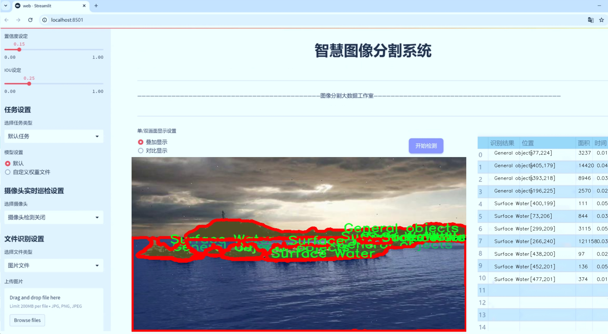
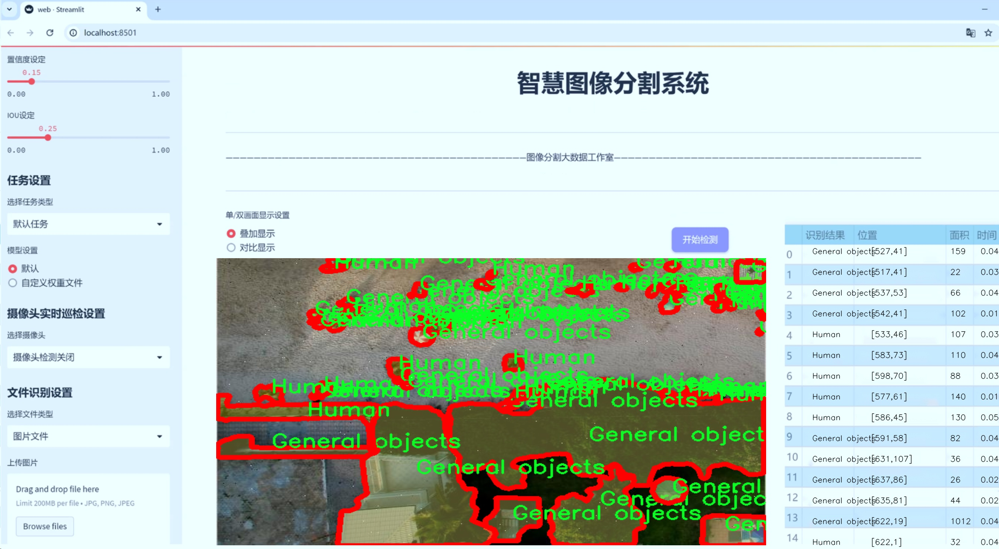
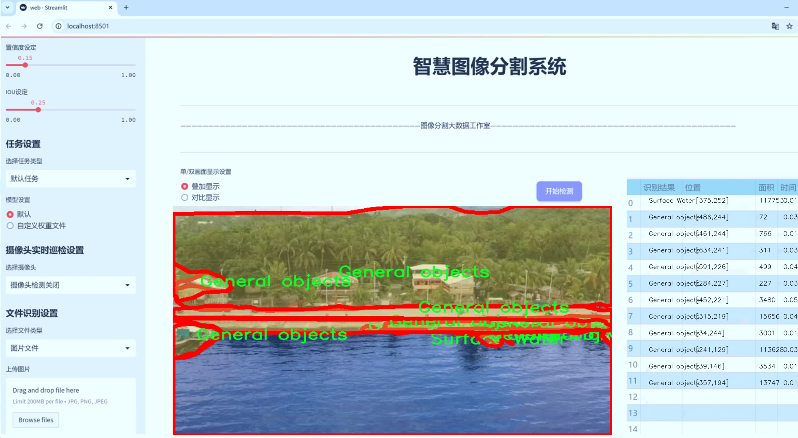
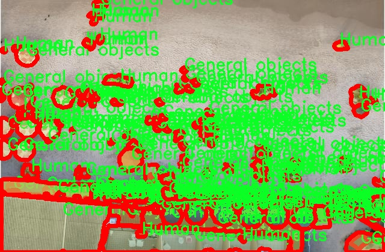
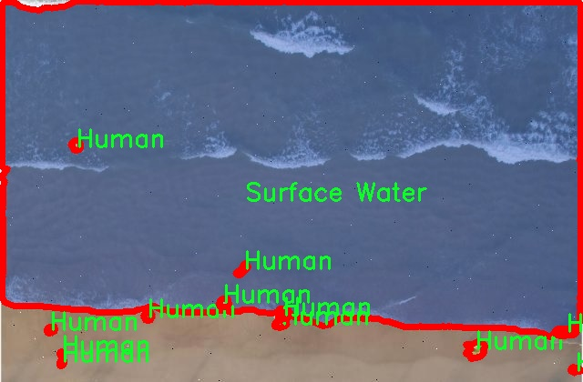
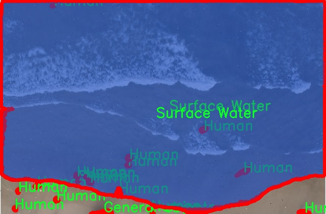
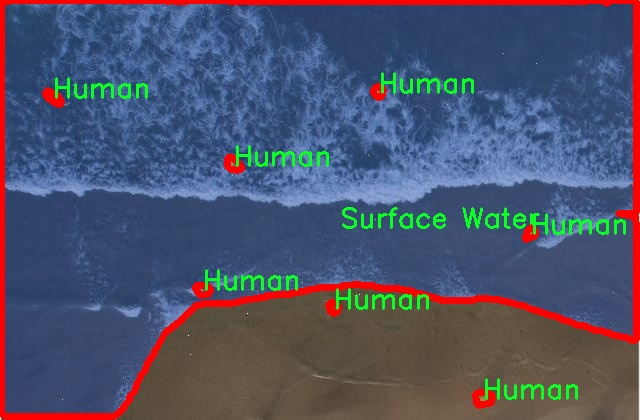
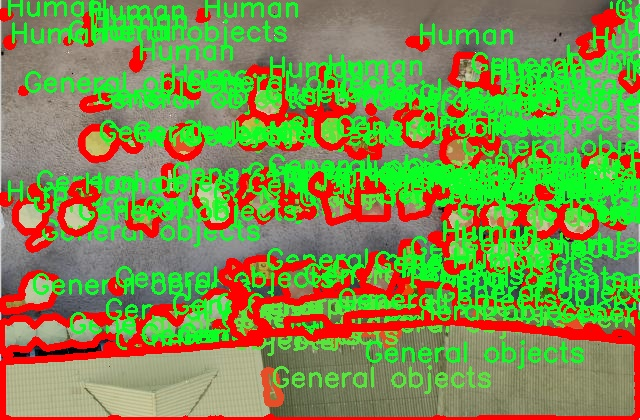

# 海滩场景对象图像分割系统源码＆数据集分享
 [yolov8-seg-EfficientFormerV2＆yolov8-seg等50+全套改进创新点发刊_一键训练教程_Web前端展示]

### 1.研究背景与意义

项目参考[ILSVRC ImageNet Large Scale Visual Recognition Challenge](https://gitee.com/YOLOv8_YOLOv11_Segmentation_Studio/projects)

项目来源[AAAI Global Al lnnovation Contest](https://kdocs.cn/l/cszuIiCKVNis)

研究背景与意义

随着计算机视觉技术的迅猛发展，图像分割作为其中的重要研究方向，已经在多个领域得到了广泛应用。尤其是在海滩场景的对象识别与分割中，准确识别和分割不同类别的对象，不仅对环境监测、生态保护、旅游管理等领域具有重要意义，同时也为智能交通、无人机巡检等新兴应用提供了技术支持。近年来，YOLO（You Only Look Once）系列模型因其高效的实时处理能力和较高的准确率，成为目标检测和图像分割领域的研究热点。其中，YOLOv8作为该系列的最新版本，在性能上有了显著提升，尤其是在小目标检测和复杂场景下的表现，使其成为海滩场景对象图像分割的理想选择。

本研究围绕基于改进YOLOv8的海滩场景对象图像分割系统展开，旨在通过对海滩场景中不同类别对象的精准识别与分割，提升海洋环境监测和管理的智能化水平。数据集“Coastline 2”包含1400幅图像，涵盖了三类对象：一般物体、人类和水面。这些对象在海滩场景中具有高度的多样性和复杂性，尤其是人类活动和水面反射等因素，给图像分割带来了挑战。因此，如何在复杂的海滩环境中实现高效、准确的对象分割，成为本研究的核心问题。

在海滩场景中，一般物体（如沙滩椅、遮阳伞等）和人类活动（如游泳、晒太阳等）是影响环境质量的重要因素，而水面则是生态系统的重要组成部分。通过对这些对象的分割与分析，可以为海洋生态保护提供数据支持，帮助决策者制定科学合理的管理策略。此外，随着海洋旅游业的快速发展，海滩场景的管理与监控需求日益增加，基于图像分割的智能化系统将为提升管理效率、优化资源配置提供重要技术保障。

本研究的意义不仅在于技术上的创新，更在于其应用价值的广泛性。通过改进YOLOv8模型，我们期望能够在保证实时性的同时，提升海滩场景对象分割的准确性和鲁棒性。这将为海洋环境监测、海滩安全管理、生态保护等领域提供强有力的技术支持，推动相关领域的智能化进程。此外，研究成果还可以为后续的图像分割研究提供参考，促进计算机视觉技术在其他复杂场景中的应用。

综上所述，基于改进YOLOv8的海滩场景对象图像分割系统的研究，不仅具有重要的理论价值，更具备广泛的实践意义。通过深入探索海滩场景中的对象分割技术，我们期待为海洋环境的可持续发展贡献一份力量，同时推动计算机视觉技术在实际应用中的进一步发展。

### 2.图片演示







##### 注意：由于此博客编辑较早，上面“2.图片演示”和“3.视频演示”展示的系统图片或者视频可能为老版本，新版本在老版本的基础上升级如下：（实际效果以升级的新版本为准）

  （1）适配了YOLOV8的“目标检测”模型和“实例分割”模型，通过加载相应的权重（.pt）文件即可自适应加载模型。

  （2）支持“图片识别”、“视频识别”、“摄像头实时识别”三种识别模式。

  （3）支持“图片识别”、“视频识别”、“摄像头实时识别”三种识别结果保存导出，解决手动导出（容易卡顿出现爆内存）存在的问题，识别完自动保存结果并导出到tempDir中。

  （4）支持Web前端系统中的标题、背景图等自定义修改，后面提供修改教程。

  另外本项目提供训练的数据集和训练教程,暂不提供权重文件（best.pt）,需要您按照教程进行训练后实现图片演示和Web前端界面演示的效果。

### 3.视频演示

[3.1 视频演示](https://www.bilibili.com/video/BV1PTmBYzEyQ/)

### 4.数据集信息展示

##### 4.1 本项目数据集详细数据（类别数＆类别名）

nc: 3
names: ['General objects', 'Human', 'Surface Water']


##### 4.2 本项目数据集信息介绍

数据集信息展示

在本研究中，我们采用了名为“Coastline 2”的数据集，以训练和改进YOLOv8-seg模型，旨在实现高效的海滩场景对象图像分割。该数据集专注于海滩环境中的多种对象，提供了丰富的标注信息，能够有效支持深度学习模型在复杂场景中的表现。数据集包含三类主要对象，分别是“General objects”（一般物体）、“Human”（人类）和“Surface Water”（水面），这些类别的选择充分考虑了海滩场景的多样性和复杂性。

“Coastline 2”数据集的设计初衷是为了满足现代计算机视觉任务的需求，尤其是在图像分割领域。通过对海滩场景的细致观察和数据采集，该数据集不仅涵盖了人类活动的痕迹，如游客、运动者等，还包括自然元素，如海水、沙滩等。这样的多样性使得模型在训练过程中能够学习到不同类别之间的特征差异，从而提高其在实际应用中的泛化能力。

在数据集的构建过程中，研究团队进行了广泛的实地考察，收集了大量高质量的图像。这些图像涵盖了不同时间、不同天气条件下的海滩场景，确保了数据集的代表性和全面性。此外，数据集中的每一张图像都经过精确的标注，确保了每个对象的边界清晰可辨。这种高质量的标注对于训练深度学习模型至关重要，因为它直接影响到模型的学习效果和最终的分割精度。

数据集的类别设置为三类，使得模型在训练时能够专注于特定的对象特征。首先，“General objects”类别涵盖了海滩上常见的各种物体，如伞、椅子、玩具等，这些物体的存在不仅影响了海滩的视觉效果，也与人类活动密切相关。其次，“Human”类别专注于人类个体，考虑到海滩场景中人类活动的多样性，模型需要能够识别不同姿态、不同服装的个体，以便在分割时能够准确区分人类与其他物体。最后，“Surface Water”类别则是海滩场景中不可或缺的一部分，水面在视觉上具有独特的特征，模型需要学习如何处理水面与沙滩之间的边界，以实现精确的分割。

通过对“Coastline 2”数据集的深入分析和利用，我们期望能够显著提升YOLOv8-seg模型在海滩场景中的表现，尤其是在对象识别和分割的准确性上。数据集的多样性和丰富性为模型提供了良好的训练基础，使其能够在复杂的海滩环境中有效地识别和分割出不同的对象。最终，我们希望通过本研究能够为海滩场景的智能监测、环境保护以及人类活动的管理提供有效的技术支持，为相关领域的研究和应用开辟新的方向。











### 5.全套项目环境部署视频教程（零基础手把手教学）

[5.1 环境部署教程链接（零基础手把手教学）](https://www.bilibili.com/video/BV1jG4Ve4E9t/?vd_source=bc9aec86d164b67a7004b996143742dc)


[5.2 安装Python虚拟环境创建和依赖库安装视频教程链接（零基础手把手教学）](https://www.bilibili.com/video/BV1nA4VeYEze/?vd_source=bc9aec86d164b67a7004b996143742dc)

### 6.手把手YOLOV8-seg训练视频教程（零基础小白有手就能学会）

[6.1 手把手YOLOV8-seg训练视频教程（零基础小白有手就能学会）](https://www.bilibili.com/video/BV1cA4VeYETe/?vd_source=bc9aec86d164b67a7004b996143742dc)


按照上面的训练视频教程链接加载项目提供的数据集，运行train.py即可开始训练



     Epoch   gpu_mem       box       obj       cls    labels  img_size
     1/200     0G   0.01576   0.01955  0.007536        22      1280: 100%|██████████| 849/849 [14:42<00:00,  1.04s/it]
               Class     Images     Labels          P          R     mAP@.5 mAP@.5:.95: 100%|██████████| 213/213 [01:14<00:00,  2.87it/s]
                 all       3395      17314      0.994      0.957      0.0957      0.0843

     Epoch   gpu_mem       box       obj       cls    labels  img_size
     2/200     0G   0.01578   0.01923  0.007006        22      1280: 100%|██████████| 849/849 [14:44<00:00,  1.04s/it]
               Class     Images     Labels          P          R     mAP@.5 mAP@.5:.95: 100%|██████████| 213/213 [01:12<00:00,  2.95it/s]
                 all       3395      17314      0.996      0.956      0.0957      0.0845

     Epoch   gpu_mem       box       obj       cls    labels  img_size
     3/200     0G   0.01561    0.0191  0.006895        27      1280: 100%|██████████| 849/849 [10:56<00:00,  1.29it/s]
               Class     Images     Labels          P          R     mAP@.5 mAP@.5:.95: 100%|███████   | 187/213 [00:52<00:00,  4.04it/s]
                 all       3395      17314      0.996      0.957      0.0957      0.0845


### 7.50+种全套YOLOV8-seg创新点代码加载调参视频教程（一键加载写好的改进模型的配置文件）

[7.1 50+种全套YOLOV8-seg创新点代码加载调参视频教程（一键加载写好的改进模型的配置文件）](https://www.bilibili.com/video/BV1Hw4VePEXv/?vd_source=bc9aec86d164b67a7004b996143742dc)

### 8.YOLOV8-seg图像分割算法原理

原始YOLOV8-seg算法原理

YOLOv8-seg算法是目标检测和图像分割领域的一项重要进展，代表了深度学习技术在计算机视觉应用中的最新成果。该算法在YOLO系列的基础上进行了多项创新，尤其是在网络结构和训练策略方面，极大地提升了目标检测的精度和速度。YOLOv8-seg的设计理念旨在解决传统目标检测算法在复杂场景下的局限性，通过引入更为高效的特征提取和融合机制，使得模型能够在实时性和准确性之间达到更好的平衡。

YOLOv8-seg的网络结构主要由三个部分组成：Backbone、Neck和Head。这种分层结构不仅使得模型的设计更加清晰，也便于在不同的应用场景中进行调整和优化。Backbone部分是整个网络的基础，负责从输入图像中提取多层次的特征信息。YOLOv8-seg采用了一系列卷积和反卷积层，结合残差连接和瓶颈结构，以减小网络的参数量并提高特征提取的效率。具体而言，Backbone由多个CBS模块和C2f模块构成，其中C2模块作为基本构成单元，通过跨层连接增强了特征的流动性，进而改善了模型的梯度传播。这种设计不仅提升了模型的训练速度，也使得最终的检测结果更加稳定。

在Backbone提取到的特征基础上，Neck部分通过多尺度特征融合技术，将来自不同阶段的特征图进行整合。这一过程至关重要，因为目标在图像中的尺寸和形状各异，单一尺度的特征图往往无法有效捕捉到所有目标的信息。YOLOv8-seg通过引入特征金字塔网络（FPN）和路径聚合网络（PAN），实现了不同尺度特征的有效融合。这种融合不仅提高了目标检测的性能，还增强了模型对复杂场景的鲁棒性，使得YOLOv8-seg在多种应用场景中都能表现出色。

最后，Head部分负责最终的目标检测和分类任务。YOLOv8-seg设计了多个检测头，以便在不同的尺寸信息下进行目标检测。每个检测头都包含一系列卷积层和反卷积层，负责生成最终的检测结果。在YOLOv8-seg中，解耦的检测头结构使得回归和分类的损失可以分别计算，这种设计不仅提高了模型的学习效率，也使得损失函数的优化更加灵活。通过这种方式，YOLOv8-seg能够在处理复杂场景时，保持高效的检测速度和准确性。

值得一提的是，YOLOv8-seg在训练过程中引入了新的损失函数设计，借鉴了PP-YOLOE等先进算法的优点。这种损失函数不仅考虑了目标的定位精度，还对分类的准确性进行了加权，从而使得模型在训练时能够更好地适应不同类型的目标。这种创新的损失函数设计，进一步提升了YOLOv8-seg在实际应用中的表现，使其在各种复杂场景下都能实现高效的目标检测和分割。

此外，YOLOv8-seg的训练和部署框架采用了Pytorch这一深度学习框架，使得自定义模型的训练变得更加方便。研究人员和开发者可以根据具体的应用需求，灵活调整网络结构和训练参数，从而实现个性化的目标检测解决方案。这种灵活性不仅加速了模型的开发过程，也为实际应用提供了更多的可能性。

总的来说，YOLOv8-seg算法通过一系列创新的设计和优化，显著提升了目标检测和图像分割的性能。其高效的特征提取、灵活的特征融合以及解耦的检测头结构，使得YOLOv8-seg在实时检测和高精度任务中表现出色。随着该算法的不断发展和应用，预计将为目标检测领域带来更多的创新和突破，推动计算机视觉技术的进一步发展。


### 9.系统功能展示（检测对象为举例，实际内容以本项目数据集为准）

图9.1.系统支持检测结果表格显示

  图9.2.系统支持置信度和IOU阈值手动调节

  图9.3.系统支持自定义加载权重文件best.pt(需要你通过步骤5中训练获得)

  图9.4.系统支持摄像头实时识别

  图9.5.系统支持图片识别

  图9.6.系统支持视频识别

  图9.7.系统支持识别结果文件自动保存

  图9.8.系统支持Excel导出检测结果数据


### 10.50+种全套YOLOV8-seg创新点原理讲解（非科班也可以轻松写刊发刊，V11版本正在科研待更新）

#### 10.1 由于篇幅限制，每个创新点的具体原理讲解就不一一展开，具体见下列网址中的创新点对应子项目的技术原理博客网址【Blog】：


[10.1 50+种全套YOLOV8-seg创新点原理讲解链接](https://gitee.com/qunmasj/good)

#### 10.2 部分改进模块原理讲解(完整的改进原理见上图和技术博客链接)【如果此小节的图加载失败可以通过CSDN或者Github搜索该博客的标题访问原始博客，原始博客图片显示正常】
### YOLOv8简介
在各种目标检测算法中，YOLO系列因其速度和准确度间的优异平衡脱颖而出，能够准确、快速的识别目标，便于部署到各种移动设备中，已经广泛应用于各种领域的目标检测、跟踪和分割。目前最新版本 YOLOv8由原v5的开发团队Ultralytics于2023年1月提出，按规格大小可划分为n、s、m、1和x5个版本，是目前最先进的目标检测算法，有着优异的性能，很适合用于无人机航拍图像目标检测。其网络结构如图所示。

YOLOv8模型包括Input、Backbone、Neck 和Head4部分。其中 Input选用了Mosaic数据增强方法，并且对于不同大小的模型，有部分超参数会进行修改，典型的如大模型会开启 MixUp 和CopyPaste数据增强，能够丰富数据集，提升模型的泛化能力和鲁棒性。Backbone主要用于提取图片中的信息，提供给Neck和Head使用，由多个Conv、C2f模块和尾部的SPPF组成。Conv模块由单个Conv2d、
BatchNorm2d和激活函数构成,用丁是双行在万E5特征图;YOLOv8参考了C3模块的残左绒以心YOLOv7[16l的ELAN思想，设计出了C2f 结构，可以在保证轻量化的同时获得更加丰富的梯度流信息，并根据模型尺度来调整通道数，大幅提升了模型性能;SPPF是空间金字塔池化，能够融合不同尺度的特征。Neck部分主要起特征融合的作用，充分利用了骨干网络提取的特征，采用FPN[17]+PAN[18〕结构，
能够增强多个尺度上的语义表达和定位能力。Head输出端根据前两部分处理得到的特征来获取检测目标的类别和位置信息，做出识别,换以小旦公来和定解耦头结构,将分类和检测头分:9w‘无锅框的位关注侧重点不同的问题，同时也采用了无锚框的目标检测（Anchor-Free)，能够提升检测速度。Loss计算方面采用了正负样本动态分配策略，使用 VFLLoss 作为分类损失，使用DFLLoss+CIOU Loss作为回归损失。

### AutoFocus: Efficient Multi-Scale Conv简介

参考该博客提出了AutoFocus，一种高效的多尺度目标检测算法。相较于以前对整个图像金字塔进行处理，该方法以一种由表及里的姿态，仅处理哪些整体上看来很有可能存在小物体的区域。这个可以通过预测一张类别未知的分割图FocusPixels来得到。为了高效利用FocusPixels，另外一个算法用于产生包含FocusPixels的FocusChips，这样可以减少计算量并处理更更精细的尺度。在不同尺度上FocusChips所得到的检测结果综合时，会出现问题，我们也提供了解决问题的方案。AutoFocus在COCO上的结果有49.7%mAP（50%重叠下68.3%），与多尺度baseline相仿但是快了2.5倍。金字塔中处理的像素数量减少了5倍mAP只下降1%，在与RetinaNet采用相同的ResNet-101结构且速度相同时，高了10%mAP。

人类寻找物体是一个动态的过程，且寻找时间与场景的复杂度是直接相关的。当我们的眼神在不同的点之间漂移时，其他的区域会被我们有意忽视。然而，现在的检测算法是一种静态的推理过程且图像金字塔中的每个像素都受到了一样的对待，这使得过程变得没有效率。现在许多的应用都不强调实时性，而计算上的节省其实可以产生很大收益。

在COCO数据集中，虽然40%的物体都是小物体，但是它们一共只占了全图的0.3%。如果金字塔是3倍关系，则在高分辨率层要进行9倍的运算。XXX 。那么有没有办法在低分辨率下找出可能含有这些物体的区域呢？

以人眼方案类比，我们可以从低分辨率图像开始，找出有可能存在物体的区域再“聚集”到高分辨率。我们的AutoFocus会在一层中计算小物体的分割图FocusPixels，而在每一个FocusPixels上会用一个算法产生下一层所需要关注的chips。在COCO的最大分辨率层上我们可以只处理**20%的像素而性能不下降，如果只处理5%**也只下降1%而已。


图像金字塔与卷积神经网络对CV十分重要。然而卷积神经网络无法做到对尺度不敏感，所以为了不同大小的物体需要依赖图像金字塔。虽然训练已经有了高效的方法，但是其推断时间依然远离实际使用标准。

目标检测加速有很长历史了。常用的有特征近似以减少尺度、级联、特征金字塔，且最后一个最近很多人研究。

AutoFocus为速度与精度之间提供了一个平滑的折衷，指出可以在低分辨率下看出小物体的所在，从而节约计算。FocusPixels的计算较为容易。

先简单介绍一下SNIP，是一种多尺度的训练、推断算法。主要思想是训练针对某个特定scale的检测器而不是scale-invariant检测器。这样训练样本就局限于在某个尺度范围内，以适于这个检测器处理。比如在高分辨率仅处理小物体而高分辨率仅处理大物体，其优势在于训练时不用考虑尺度的变化。

由于训练时物体大小是已知的，我们在图像金字塔中可以忽略大量区域而只处理物体周围的区域。SNIPER说明这样低分辨率的训练与全图训练相比并不会降低性能。同样，在推断过程中如果可以在大分辨率图像上预测可能出现小物体的chip，我们也就不用处理整张高分辨率图片。在训练时，许多物体会被裁剪、扭曲，这可以当作是一种数据扩增，然而当这个情况在推断时出现，则会产生错误，所以我们还需要一个算法来整合不同尺度上的检测结果。

#### AutoFocus框架
如SIFT、SURF等传统分类特征包含两个组件，一个detector和一个descriptor。detector只包含轻量级的操作如DoG、LoG，用于在整张图片上找到感兴趣的区域；descriptor，一般来说计算量比较大，则只需要关注那些咸兴趣的区域。这个级联结构保障了图片处理的效率。

同样，AutoFocus框架也是用于预测感兴趣的区域，并丢弃在下一尺度不可能存在物体的区域，并将裁剪和缩放后的区域传递给下一尺度。AutoFocus由三个部分组成：FocusPixels，FocusChips和focus stacking。

#### FocusPixels
FocusPixels定义在卷积网络特征图的粒度之上（如conv5），如果特征图上某个像素与小物体有重叠则标注为一个FocusPixel。（小物体：面积处于一个网络的输入范围之内）。训练过程中，FocusPixels标注为正，某些与不在面积范围内的物体有重叠的像素标注为无效，其他像素标注为负。AutoFocus的训练目标是使在FocusPixels区域产生较大的激活值。

如果同时多个物体与同一像素重叠，优先给正标注。我们的网络输入是512x512，然后a,b,c取值分别是5,64,90。对于太大或太小的物体，我们认为当前尺度上没有足够人信息进行判断，所以会标定为无效。整个网络结构如下图。训练时加两层带ReLU的卷积(3x3和1x1)以及一个二分类softmax来预测FocusPixels。


#### FocusChip生成
推断过程中，我们标注输出概率大于阈值t的像素（这个参数可以控制加速比），得到一些连通域。对于每一个域，我们做一次膨胀使其包含一些有助于识别的周围信息，膨胀后相连的部分要合并。然后，我们生成一些包含连通域的chips（不同chips可能重叠，如有重叠则合并）。有些chip可能太小缺少必要信息，并使chip的大小变化很大，为了效率我们要求保证一个最小的chip size。算法流程如下：


#### 级联推断过程
我们的过程类似于图片金字塔的推断过程但是在过程中一步步去除不关注的图片区域。我们在最低分辨率上进行检测并生成chips，然后在这些chips再进行检测和生成chips。

#### Focus Stacking
这种级联分类器的一个问题是在chip边缘本来的大物体可能生成一些被剪裁的检测目标。在下一个尺度上，由于剪裁过了，所以会检测到小的、错误的正例False Positive。之前算法中的第二步膨胀其实就是为了保证没有物体会出现在chip的边缘。这样，当我们在局部图片chip的边缘检测到物体时，就可以把这个检测结果丢弃，即使其在SNIP的范围内。

也有一些物体在图片边缘的特殊情况。如果chip和图片共享一条边的话，我们会检查检测结果的其他边是否完全在里面，如果在，则保留它，否则丢弃。

在每一尺度得到有效检测结果后，我们可以将不同尺度上的结果进行整合，将这些结果映射到原图坐标系上。最后，非极大值抑制NMS用于聚集。网络结构如之前的图片所示。


### 11.项目核心源码讲解（再也不用担心看不懂代码逻辑）

#### 11.1 demo_test_camera.py

以下是经过简化和注释的核心代码部分：

```python
import cv2
import numpy as np
from PIL import ImageFont, ImageDraw, Image
from hashlib import md5
from model import Web_Detector
from chinese_name_list import Label_list

def generate_color_based_on_name(name):
    """
    根据名称生成稳定的颜色。
    使用MD5哈希函数将名称转换为颜色值。
    """
    hash_object = md5(name.encode())
    hex_color = hash_object.hexdigest()[:6]  # 取前6位16进制数
    r, g, b = int(hex_color[0:2], 16), int(hex_color[2:4], 16), int(hex_color[4:6], 16)
    return (b, g, r)  # OpenCV 使用BGR格式

def draw_with_chinese(image, text, position, font_size=20, color=(255, 0, 0)):
    """
    在图像上绘制中文文本。
    """
    image_pil = Image.fromarray(cv2.cvtColor(image, cv2.COLOR_BGR2RGB))
    draw = ImageDraw.Draw(image_pil)
    font = ImageFont.truetype("simsun.ttc", font_size, encoding="unic")
    draw.text(position, text, font=font, fill=color)
    return cv2.cvtColor(np.array(image_pil), cv2.COLOR_RGB2BGR)

def draw_detections(image, info):
    """
    绘制检测结果，包括边界框、类别名称和其他信息。
    """
    name, bbox = info['class_name'], info['bbox']
    x1, y1, x2, y2 = bbox
    # 绘制边界框
    cv2.rectangle(image, (x1, y1), (x2, y2), color=(0, 0, 255), thickness=3)
    # 绘制类别名称
    image = draw_with_chinese(image, name, (x1, y1 - 10), font_size=20)
    return image

def process_frame(model, image):
    """
    处理每一帧图像，进行目标检测并绘制结果。
    """
    pre_img = model.preprocess(image)  # 预处理图像
    pred = model.predict(pre_img)  # 进行预测
    det = pred[0]  # 获取检测结果

    if det is not None and len(det):
        det_info = model.postprocess(pred)  # 后处理获取检测信息
        for info in det_info:
            image = draw_detections(image, info)  # 绘制检测结果
    return image

if __name__ == "__main__":
    model = Web_Detector()  # 初始化检测模型
    model.load_model("./weights/yolov8s-seg.pt")  # 加载模型权重

    # 摄像头实时处理
    cap = cv2.VideoCapture(0)  # 打开摄像头
    while cap.isOpened():
        ret, frame = cap.read()  # 读取帧
        if not ret:
            break
        processed_frame = process_frame(model, frame)  # 处理帧
        cv2.imshow('Camera Feed', processed_frame)  # 显示处理后的帧
        if cv2.waitKey(1) & 0xFF == ord('q'):  # 按'q'退出
            break
    cap.release()  # 释放摄像头
    cv2.destroyAllWindows()  # 关闭所有窗口
```

### 代码说明：
1. **generate_color_based_on_name**: 根据输入的名称生成一个稳定的颜色，使用MD5哈希函数来确保同一名称总是生成相同的颜色。
2. **draw_with_chinese**: 在图像上绘制中文文本，使用PIL库处理图像并将其转换为OpenCV格式。
3. **draw_detections**: 根据检测结果在图像上绘制边界框和类别名称。
4. **process_frame**: 处理每一帧图像，进行目标检测并绘制结果。
5. **主程序**: 初始化模型，打开摄像头并实时处理每一帧，直到用户按下'q'键退出。

这个程序文件 `demo_test_camera.py` 是一个用于实时视频处理的脚本，主要功能是通过摄像头捕捉图像并使用深度学习模型进行目标检测和分割。以下是对代码的逐步分析和说明。

首先，程序导入了一些必要的库，包括 `random`、`cv2`（OpenCV库）、`numpy`、`PIL`（用于处理图像的库）、`hashlib`（用于生成哈希值）、以及自定义的 `Web_Detector` 模型和 `Label_list` 类别标签。

接下来，定义了几个辅助函数。`generate_color_based_on_name` 函数使用 MD5 哈希算法根据输入的名称生成一个稳定的颜色值，返回值为 BGR 格式的颜色元组，这在 OpenCV 中是常用的颜色表示方式。`calculate_polygon_area` 函数计算给定点的多边形面积，使用 OpenCV 的 `contourArea` 方法。

`draw_with_chinese` 函数用于在图像上绘制中文文本。它将 OpenCV 图像转换为 PIL 图像，以便使用 TrueType 字体绘制中文字符，并将绘制后的图像转换回 OpenCV 格式。`adjust_parameter` 函数根据图像的大小调整参数，以确保绘制的元素在不同分辨率下保持适当的比例。

`draw_detections` 函数是核心功能之一，它根据检测到的信息在图像上绘制边界框、掩码和相关的度量信息（如面积、周长、圆度和颜色）。如果检测到的对象有掩码，函数会填充多边形并计算相关的几何特征，同时也会在图像上绘制这些信息。

`process_frame` 函数负责处理每一帧图像。它首先对图像进行预处理，然后通过模型进行预测，最后将检测到的对象信息传递给 `draw_detections` 函数进行可视化。

在 `__main__` 块中，程序初始化了类别名称列表和深度学习模型，并加载了预训练的权重文件。接着，使用 OpenCV 打开摄像头并进入一个循环，实时读取摄像头帧并进行处理，处理后的帧通过 OpenCV 的 `imshow` 显示在窗口中。如果用户按下 'q' 键，程序将退出循环，释放摄像头资源并关闭所有窗口。

总体而言，这个程序实现了一个实时的目标检测和分割系统，能够在视频流中识别和标注对象，并以友好的方式展示检测结果。

#### 11.2 ultralytics\utils\callbacks\clearml.py

以下是经过简化和注释的核心代码部分：

```python
# 导入必要的库
from ultralytics.utils import LOGGER, SETTINGS, TESTS_RUNNING

# 尝试导入 ClearML 相关的库并进行基本的检查
try:
    assert not TESTS_RUNNING  # 确保当前不是在运行测试
    assert SETTINGS['clearml'] is True  # 确保 ClearML 集成已启用
    import clearml
    from clearml import Task
    from clearml.binding.frameworks.pytorch_bind import PatchPyTorchModelIO
    from clearml.binding.matplotlib_bind import PatchedMatplotlib

    assert hasattr(clearml, '__version__')  # 确保 ClearML 是一个有效的包

except (ImportError, AssertionError):
    clearml = None  # 如果导入失败，设置 clearml 为 None


def _log_debug_samples(files, title='Debug Samples') -> None:
    """
    记录调试样本（图像）到 ClearML 任务中。

    参数:
        files (list): 文件路径列表，格式为 PosixPath。
        title (str): 图像分组的标题。
    """
    import re

    task = Task.current_task()  # 获取当前任务
    if task:
        for f in files:
            if f.exists():  # 检查文件是否存在
                it = re.search(r'_batch(\d+)', f.name)  # 从文件名中提取批次号
                iteration = int(it.groups()[0]) if it else 0  # 获取迭代次数
                task.get_logger().report_image(title=title,
                                               series=f.name.replace(it.group(), ''),
                                               local_path=str(f),
                                               iteration=iteration)  # 记录图像


def on_pretrain_routine_start(trainer):
    """在预训练例程开始时运行；初始化并连接/记录任务到 ClearML。"""
    try:
        task = Task.current_task()  # 获取当前任务
        if task:
            # 禁用自动的 PyTorch 和 Matplotlib 绑定
            PatchPyTorchModelIO.update_current_task(None)
            PatchedMatplotlib.update_current_task(None)
        else:
            # 初始化一个新的 ClearML 任务
            task = Task.init(project_name=trainer.args.project or 'YOLOv8',
                             task_name=trainer.args.name,
                             tags=['YOLOv8'],
                             output_uri=True,
                             reuse_last_task_id=False,
                             auto_connect_frameworks={
                                 'pytorch': False,
                                 'matplotlib': False})
            LOGGER.warning('ClearML 初始化了一个新任务。如果要远程运行，请添加 clearml-init 并连接参数。')
        task.connect(vars(trainer.args), name='General')  # 连接训练参数
    except Exception as e:
        LOGGER.warning(f'警告 ⚠️ ClearML 安装但未正确初始化，未记录此运行。{e}')


def on_train_epoch_end(trainer):
    """在 YOLO 训练的每个 epoch 结束时记录调试样本并报告当前训练进度。"""
    task = Task.current_task()  # 获取当前任务
    if task:
        if trainer.epoch == 1:  # 仅在第一个 epoch 记录调试样本
            _log_debug_samples(sorted(trainer.save_dir.glob('train_batch*.jpg')), 'Mosaic')
        # 报告当前训练进度
        for k, v in trainer.validator.metrics.results_dict.items():
            task.get_logger().report_scalar('train', k, v, iteration=trainer.epoch)


# 定义回调函数字典，仅在 ClearML 可用时
callbacks = {
    'on_pretrain_routine_start': on_pretrain_routine_start,
    'on_train_epoch_end': on_train_epoch_end,
} if clearml else {}
```

### 代码说明：
1. **导入模块**：导入必要的库和模块，包括 `clearml` 和 `ultralytics` 的工具。
2. **异常处理**：尝试导入 `clearml`，并进行基本的有效性检查，如果失败则将 `clearml` 设置为 `None`。
3. **记录调试样本**：定义 `_log_debug_samples` 函数，用于将图像记录到 ClearML 任务中，提取批次号并记录相关信息。
4. **预训练开始时的处理**：在 `on_pretrain_routine_start` 函数中，初始化 ClearML 任务并连接训练参数，确保不使用自动绑定。
5. **训练周期结束时的处理**：在 `on_train_epoch_end` 函数中，记录第一个 epoch 的调试样本并报告训练进度。
6. **回调函数**：定义回调函数字典，以便在 ClearML 可用时调用相应的处理函数。

这个程序文件是用于与ClearML集成的回调函数，主要用于在Ultralytics YOLO模型训练过程中记录和报告训练的相关信息。文件首先导入了一些必要的模块和库，并进行了初步的错误处理，以确保ClearML库可用且集成已启用。

在文件中，定义了一些私有函数和回调函数。`_log_debug_samples`函数用于将调试样本（通常是图像）记录到ClearML任务中。它接受一个文件路径列表和一个标题作为参数，遍历文件列表并提取批次信息，然后将图像记录到当前任务的日志中。

`_log_plot`函数用于将图像作为绘图记录到ClearML的绘图部分。它读取指定路径的图像，并使用Matplotlib库将其显示出来，然后将图像记录到当前任务的日志中。

`on_pretrain_routine_start`函数在预训练例程开始时运行，负责初始化和连接ClearML任务。它会检查当前任务是否存在，如果不存在，则创建一个新的任务并连接相关参数。同时，它确保PyTorch和Matplotlib的自动绑定被禁用，以便手动记录图像和模型文件。

`on_train_epoch_end`函数在每个训练周期结束时运行，记录调试样本并报告当前的训练进度。在第一个周期结束时，它会记录训练样本的图像，并报告当前的训练指标。

`on_fit_epoch_end`函数在每个周期结束时报告模型信息，记录当前周期的时间，并在第一个周期时记录模型的相关信息。

`on_val_end`函数在验证结束时运行，记录验证结果，包括标签和预测结果的图像。

`on_train_end`函数在训练完成时运行，记录最终模型及其名称，并记录最终的结果和指标。它会检查特定的结果文件是否存在，并将它们记录到ClearML中。

最后，文件定义了一个回调字典，将各个回调函数与特定事件关联起来，便于在训练过程中调用。如果ClearML不可用，则该字典为空。整体来看，这个文件为YOLO模型的训练过程提供了系统化的日志记录和监控功能，方便用户进行模型的调试和性能评估。

#### 11.3 ultralytics\nn\modules\conv.py

以下是经过简化和注释的核心代码部分，主要包括卷积模块的定义和一些注意力机制的实现：

```python
import torch
import torch.nn as nn

def autopad(k, p=None, d=1):
    """自动计算填充以保持输出形状与输入相同。"""
    if d > 1:
        k = d * (k - 1) + 1 if isinstance(k, int) else [d * (x - 1) + 1 for x in k]  # 实际的卷积核大小
    if p is None:
        p = k // 2 if isinstance(k, int) else [x // 2 for x in k]  # 自动填充
    return p

class Conv(nn.Module):
    """标准卷积层，包含卷积、批归一化和激活函数。"""
    default_act = nn.SiLU()  # 默认激活函数

    def __init__(self, c1, c2, k=1, s=1, p=None, g=1, d=1, act=True):
        """初始化卷积层，设置输入输出通道、卷积核大小、步幅、填充等参数。"""
        super().__init__()
        self.conv = nn.Conv2d(c1, c2, k, s, autopad(k, p, d), groups=g, dilation=d, bias=False)
        self.bn = nn.BatchNorm2d(c2)  # 批归一化
        self.act = self.default_act if act is True else act if isinstance(act, nn.Module) else nn.Identity()

    def forward(self, x):
        """前向传播：执行卷积、批归一化和激活。"""
        return self.act(self.bn(self.conv(x)))

class ChannelAttention(nn.Module):
    """通道注意力模块，用于强调重要特征通道。"""

    def __init__(self, channels: int) -> None:
        """初始化通道注意力模块，设置基本配置。"""
        super().__init__()
        self.pool = nn.AdaptiveAvgPool2d(1)  # 自适应平均池化
        self.fc = nn.Conv2d(channels, channels, 1, 1, 0, bias=True)  # 1x1卷积
        self.act = nn.Sigmoid()  # Sigmoid激活函数

    def forward(self, x: torch.Tensor) -> torch.Tensor:
        """前向传播：计算通道注意力并应用于输入。"""
        return x * self.act(self.fc(self.pool(x)))  # 通过池化和卷积计算注意力权重

class SpatialAttention(nn.Module):
    """空间注意力模块，用于强调重要空间位置。"""

    def __init__(self, kernel_size=7):
        """初始化空间注意力模块，设置卷积核大小。"""
        super().__init__()
        assert kernel_size in (3, 7), 'kernel size must be 3 or 7'
        padding = 3 if kernel_size == 7 else 1
        self.cv1 = nn.Conv2d(2, 1, kernel_size, padding=padding, bias=False)  # 卷积层
        self.act = nn.Sigmoid()  # Sigmoid激活函数

    def forward(self, x):
        """前向传播：计算空间注意力并应用于输入。"""
        # 计算输入的平均和最大值，然后拼接
        return x * self.act(self.cv1(torch.cat([torch.mean(x, 1, keepdim=True), torch.max(x, 1, keepdim=True)[0]], 1)))

class CBAM(nn.Module):
    """卷积块注意力模块，结合通道和空间注意力。"""

    def __init__(self, c1, kernel_size=7):
        """初始化CBAM模块，设置输入通道和卷积核大小。"""
        super().__init__()
        self.channel_attention = ChannelAttention(c1)  # 通道注意力
        self.spatial_attention = SpatialAttention(kernel_size)  # 空间注意力

    def forward(self, x):
        """前向传播：依次应用通道和空间注意力。"""
        return self.spatial_attention(self.channel_attention(x))
```

### 代码说明：
1. **autopad**：计算填充量以保持输入输出形状一致。
2. **Conv**：标准卷积层，包含卷积、批归一化和激活函数。
3. **ChannelAttention**：通道注意力模块，通过自适应平均池化和1x1卷积来计算通道权重。
4. **SpatialAttention**：空间注意力模块，通过对输入进行平均和最大池化，拼接后使用卷积计算空间权重。
5. **CBAM**：结合通道和空间注意力的模块，先应用通道注意力，再应用空间注意力。

这些模块是构建卷积神经网络的重要组成部分，能够有效提升模型的特征提取能力。

这个程序文件定义了一系列用于卷积操作的模块，主要用于深度学习中的卷积神经网络（CNN）。文件的核心是各种卷积层的实现，包括标准卷积、深度卷积、转置卷积等，适用于图像处理和计算机视觉任务。

首先，文件中定义了一个辅助函数`autopad`，用于自动计算卷积操作所需的填充（padding）值，以确保输出的形状与输入相同。这个函数考虑了卷积核的大小、填充和扩张（dilation）等参数。

接下来，定义了多个卷积类。`Conv`类是标准卷积层的实现，包含卷积操作、批归一化（Batch Normalization）和激活函数。构造函数中可以设置输入通道数、输出通道数、卷积核大小、步幅、填充、分组卷积、扩张和激活函数。`forward`方法实现了卷积、批归一化和激活的顺序执行。

`Conv2`类是对`Conv`类的扩展，增加了一个1x1的卷积层，并在前向传播中将两个卷积的输出相加。它还提供了`fuse_convs`方法，用于将两个卷积层融合为一个，以提高计算效率。

`LightConv`类实现了一种轻量级卷积，使用了两个卷积层的组合。`DWConv`类则实现了深度卷积，主要用于减少模型的参数量和计算量。

`DWConvTranspose2d`类实现了深度转置卷积，而`ConvTranspose`类则实现了常规的转置卷积，支持批归一化和激活函数。

`Focus`类用于将输入的空间信息聚焦到通道上，通过对输入进行分块处理并拼接来实现。`GhostConv`类实现了一种特殊的卷积，能够通过较少的参数实现更好的性能。

`RepConv`类实现了一种重复卷积结构，支持训练和推理阶段的不同操作。它包含了卷积和批归一化的融合方法，以提高推理时的效率。

文件中还定义了几个注意力机制模块，包括`ChannelAttention`和`SpatialAttention`，它们用于增强特征图的表示能力。`CBAM`类结合了这两种注意力机制，形成了一个完整的卷积块注意力模块。

最后，`Concat`类用于在指定维度上连接多个张量，常用于特征融合的场景。

总体而言，这个文件实现了多种卷积操作和注意力机制，为构建复杂的卷积神经网络提供了基础组件，适用于各种计算机视觉任务。

#### 11.4 ultralytics\models\fastsam\val.py

以下是代码中最核心的部分，并附上详细的中文注释：

```python
# 导入所需的类
from ultralytics.models.yolo.segment import SegmentationValidator
from ultralytics.utils.metrics import SegmentMetrics

class FastSAMValidator(SegmentationValidator):
    """
    自定义验证类，用于在Ultralytics YOLO框架中进行快速SAM（Segment Anything Model）分割。

    该类扩展了SegmentationValidator类，专门定制了快速SAM的验证过程。它将任务设置为'分割'，
    并使用SegmentMetrics进行评估。此外，为了避免在验证过程中出现错误，禁用了绘图功能。
    """

    def __init__(self, dataloader=None, save_dir=None, pbar=None, args=None, _callbacks=None):
        """
        初始化FastSAMValidator类，将任务设置为'分割'，并将指标设置为SegmentMetrics。

        参数：
            dataloader (torch.utils.data.DataLoader): 用于验证的数据加载器。
            save_dir (Path, optional): 保存结果的目录。
            pbar (tqdm.tqdm): 用于显示进度的进度条。
            args (SimpleNamespace): 验证器的配置。
            _callbacks (dict): 存储各种回调函数的字典。

        注意：
            在此类中禁用了ConfusionMatrix和其他相关指标的绘图，以避免错误。
        """
        # 调用父类的初始化方法
        super().__init__(dataloader, save_dir, pbar, args, _callbacks)
        
        # 设置任务类型为'分割'
        self.args.task = 'segment'
        
        # 禁用绘图功能以避免错误
        self.args.plots = False
        
        # 初始化指标为SegmentMetrics
        self.metrics = SegmentMetrics(save_dir=self.save_dir, on_plot=self.on_plot)
```

### 代码说明：
1. **导入模块**：导入`SegmentationValidator`和`SegmentMetrics`类，前者用于分割验证，后者用于计算分割指标。
2. **FastSAMValidator类**：继承自`SegmentationValidator`，专门用于快速SAM模型的验证。
3. **构造函数**：
   - 初始化时调用父类的构造函数。
   - 设置任务类型为'分割'，这意味着该验证器将专注于分割任务。
   - 禁用绘图功能，以避免在验证过程中可能出现的错误。
   - 初始化分割指标为`SegmentMetrics`，用于评估分割结果并保存到指定目录。

这个程序文件定义了一个名为 `FastSAMValidator` 的类，该类用于在 Ultralytics YOLO 框架中进行快速 SAM（Segment Anything Model）分割的自定义验证。该类继承自 `SegmentationValidator`，并针对快速 SAM 的特定需求对验证过程进行了定制。

在类的文档字符串中，说明了该类的主要功能和特点。它设置了任务类型为“分割”，并使用 `SegmentMetrics` 进行评估。此外，为了避免在验证过程中出现错误，类中禁用了绘图功能。

`FastSAMValidator` 类的构造函数 `__init__` 接受多个参数，包括数据加载器、结果保存目录、进度条对象、配置参数以及回调函数字典。构造函数首先调用父类的构造函数进行初始化，然后将任务类型设置为“segment”，并将绘图功能禁用。最后，它初始化了用于保存验证结果的 `SegmentMetrics` 对象。

总的来说，这个文件的主要目的是提供一个专门用于快速 SAM 分割任务的验证工具，确保在验证过程中能够高效地评估模型性能，同时避免不必要的绘图错误。

#### 11.5 ultralytics\data\__init__.py

以下是代码中最核心的部分，并附上详细的中文注释：

```python
# 导入基础数据集类
from .base import BaseDataset

# 导入构建数据加载器和YOLO数据集的函数
from .build import build_dataloader, build_yolo_dataset, load_inference_source

# 导入不同类型的数据集类
from .dataset import ClassificationDataset, SemanticDataset, YOLODataset

# 定义模块的公开接口，允许外部访问这些类和函数
__all__ = (
    'BaseDataset',         # 基础数据集类
    'ClassificationDataset',  # 分类数据集类
    'SemanticDataset',     # 语义分割数据集类
    'YOLODataset',         # YOLO特定的数据集类
    'build_yolo_dataset',  # 构建YOLO数据集的函数
    'build_dataloader',    # 构建数据加载器的函数
    'load_inference_source' # 加载推理源的函数
)
```

### 详细注释说明：
1. **导入模块**：
   - `from .base import BaseDataset`：从当前包的`base`模块中导入`BaseDataset`类，这是所有数据集的基础类。
   - `from .build import build_dataloader, build_yolo_dataset, load_inference_source`：从`build`模块中导入三个函数，用于构建数据加载器、构建YOLO数据集以及加载推理源。
   - `from .dataset import ClassificationDataset, SemanticDataset, YOLODataset`：从`dataset`模块中导入三种特定类型的数据集类，分别用于分类、语义分割和YOLO目标检测。

2. **`__all__`定义**：
   - `__all__`是一个特殊变量，用于定义模块的公共接口。只有在使用`from module import *`时，列出的名称才会被导入。这里列出了所有希望公开的类和函数，方便其他模块使用。

这个程序文件是Ultralytics YOLO项目中的一个初始化文件，文件名为`__init__.py`，它的主要作用是定义模块的公共接口，并导入相关的类和函数，以便在其他模块中使用。

首先，文件开头的注释部分表明这是Ultralytics YOLO项目的一部分，并且遵循AGPL-3.0许可证。这种许可证通常用于开源软件，允许用户自由使用、修改和分发软件，但要求在分发时也必须提供源代码。

接下来，文件通过相对导入的方式引入了几个模块中的类和函数。具体来说，它从`base`模块中导入了`BaseDataset`类，从`build`模块中导入了`build_dataloader`、`build_yolo_dataset`和`load_inference_source`这三个函数，从`dataset`模块中导入了`ClassificationDataset`、`SemanticDataset`和`YOLODataset`这三个类。

最后，`__all__`变量定义了该模块的公共接口，即在使用`from module import *`语句时，允许导入的名称列表。这里列出了六个名称，包括基础数据集类、三种不同类型的数据集类以及三个构建和加载数据的函数。这种做法有助于清晰地组织代码，并控制模块的可见性，确保用户只访问到必要的部分。

总的来说，这个文件的主要功能是作为Ultralytics YOLO项目中数据处理模块的入口，整合了不同的数据集和数据加载功能，方便其他模块进行调用。

### 12.系统整体结构（节选）

### 程序整体功能和构架概括

该程序是一个基于Ultralytics YOLO框架的计算机视觉项目，主要用于目标检测和分割任务。它集成了多种深度学习模型和数据处理工具，支持实时视频处理、模型训练和验证。程序的结构清晰，模块化设计使得各个功能模块之间的耦合度较低，便于维护和扩展。

- **实时视频处理**：通过`demo_test_camera.py`实现，能够捕捉摄像头图像并进行目标检测和分割。
- **回调函数**：`clearml.py`文件用于与ClearML集成，记录训练过程中的各种信息，便于监控和调试。
- **卷积模块**：`conv.py`文件实现了多种卷积操作和注意力机制，为构建深度学习模型提供了基础组件。
- **验证工具**：`val.py`文件提供了快速SAM分割任务的验证工具，确保模型性能的评估。
- **数据处理**：`__init__.py`文件整合了数据集和数据加载功能，作为数据处理模块的入口。

### 文件功能整理表

| 文件路径                                      | 功能描述                                                   |
|-----------------------------------------------|-----------------------------------------------------------|
| `demo_test_camera.py`                        | 实现实时视频处理，通过摄像头捕捉图像并进行目标检测和分割。 |
| `ultralytics/utils/callbacks/clearml.py`    | 提供与ClearML集成的回调函数，用于记录训练过程中的信息。   |
| `ultralytics/nn/modules/conv.py`            | 定义多种卷积操作和注意力机制，构建深度学习模型的基础组件。 |
| `ultralytics/models/fastsam/val.py`         | 提供快速SAM分割任务的验证工具，评估模型性能。             |
| `ultralytics/data/__init__.py`              | 整合数据集和数据加载功能，作为数据处理模块的入口。         |

这个表格总结了每个文件的主要功能，便于理解整个程序的结构和各个模块的作用。

注意：由于此博客编辑较早，上面“11.项目核心源码讲解（再也不用担心看不懂代码逻辑）”中部分代码可能会优化升级，仅供参考学习，完整“训练源码”、“Web前端界面”和“50+种创新点源码”以“14.完整训练+Web前端界面+50+种创新点源码、数据集获取”的内容为准。

### 13.图片、视频、摄像头图像分割Demo(去除WebUI)代码

在这个博客小节中，我们将讨论如何在不使用WebUI的情况下，实现图像分割模型的使用。本项目代码已经优化整合，方便用户将分割功能嵌入自己的项目中。
核心功能包括图片、视频、摄像头图像的分割，ROI区域的轮廓提取、类别分类、周长计算、面积计算、圆度计算以及颜色提取等。
这些功能提供了良好的二次开发基础。

### 核心代码解读

以下是主要代码片段，我们会为每一块代码进行详细的批注解释：

```python
import random
import cv2
import numpy as np
from PIL import ImageFont, ImageDraw, Image
from hashlib import md5
from model import Web_Detector
from chinese_name_list import Label_list

# 根据名称生成颜色
def generate_color_based_on_name(name):
    ......

# 计算多边形面积
def calculate_polygon_area(points):
    return cv2.contourArea(points.astype(np.float32))

...
# 绘制中文标签
def draw_with_chinese(image, text, position, font_size=20, color=(255, 0, 0)):
    image_pil = Image.fromarray(cv2.cvtColor(image, cv2.COLOR_BGR2RGB))
    draw = ImageDraw.Draw(image_pil)
    font = ImageFont.truetype("simsun.ttc", font_size, encoding="unic")
    draw.text(position, text, font=font, fill=color)
    return cv2.cvtColor(np.array(image_pil), cv2.COLOR_RGB2BGR)

# 动态调整参数
def adjust_parameter(image_size, base_size=1000):
    max_size = max(image_size)
    return max_size / base_size

# 绘制检测结果
def draw_detections(image, info, alpha=0.2):
    name, bbox, conf, cls_id, mask = info['class_name'], info['bbox'], info['score'], info['class_id'], info['mask']
    adjust_param = adjust_parameter(image.shape[:2])
    spacing = int(20 * adjust_param)

    if mask is None:
        x1, y1, x2, y2 = bbox
        aim_frame_area = (x2 - x1) * (y2 - y1)
        cv2.rectangle(image, (x1, y1), (x2, y2), color=(0, 0, 255), thickness=int(3 * adjust_param))
        image = draw_with_chinese(image, name, (x1, y1 - int(30 * adjust_param)), font_size=int(35 * adjust_param))
        y_offset = int(50 * adjust_param)  # 类别名称上方绘制，其下方留出空间
    else:
        mask_points = np.concatenate(mask)
        aim_frame_area = calculate_polygon_area(mask_points)
        mask_color = generate_color_based_on_name(name)
        try:
            overlay = image.copy()
            cv2.fillPoly(overlay, [mask_points.astype(np.int32)], mask_color)
            image = cv2.addWeighted(overlay, 0.3, image, 0.7, 0)
            cv2.drawContours(image, [mask_points.astype(np.int32)], -1, (0, 0, 255), thickness=int(8 * adjust_param))

            # 计算面积、周长、圆度
            area = cv2.contourArea(mask_points.astype(np.int32))
            perimeter = cv2.arcLength(mask_points.astype(np.int32), True)
            ......

            # 计算色彩
            mask = np.zeros(image.shape[:2], dtype=np.uint8)
            cv2.drawContours(mask, [mask_points.astype(np.int32)], -1, 255, -1)
            color_points = cv2.findNonZero(mask)
            ......

            # 绘制类别名称
            x, y = np.min(mask_points, axis=0).astype(int)
            image = draw_with_chinese(image, name, (x, y - int(30 * adjust_param)), font_size=int(35 * adjust_param))
            y_offset = int(50 * adjust_param)

            # 绘制面积、周长、圆度和色彩值
            metrics = [("Area", area), ("Perimeter", perimeter), ("Circularity", circularity), ("Color", color_str)]
            for idx, (metric_name, metric_value) in enumerate(metrics):
                ......

    return image, aim_frame_area

# 处理每帧图像
def process_frame(model, image):
    pre_img = model.preprocess(image)
    pred = model.predict(pre_img)
    det = pred[0] if det is not None and len(det)
    if det:
        det_info = model.postprocess(pred)
        for info in det_info:
            image, _ = draw_detections(image, info)
    return image

if __name__ == "__main__":
    cls_name = Label_list
    model = Web_Detector()
    model.load_model("./weights/yolov8s-seg.pt")

    # 摄像头实时处理
    cap = cv2.VideoCapture(0)
    while cap.isOpened():
        ret, frame = cap.read()
        if not ret:
            break
        ......

    # 图片处理
    image_path = './icon/OIP.jpg'
    image = cv2.imread(image_path)
    if image is not None:
        processed_image = process_frame(model, image)
        ......

    # 视频处理
    video_path = ''  # 输入视频的路径
    cap = cv2.VideoCapture(video_path)
    while cap.isOpened():
        ret, frame = cap.read()
        ......
```


### 14.完整训练+Web前端界面+50+种创新点源码、数据集获取


# [下载链接：https://mbd.pub/o/bread/Z5WalJtt](https://mbd.pub/o/bread/Z5WalJtt)